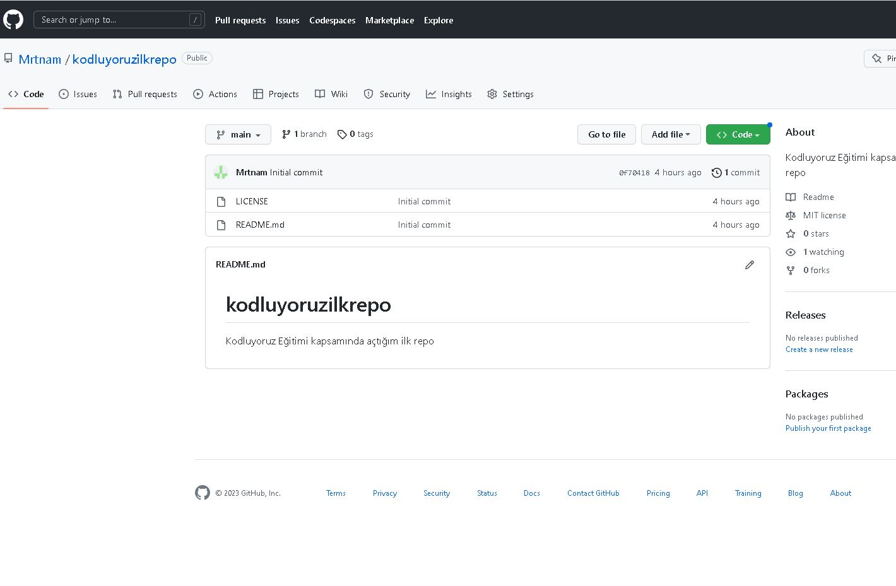

# Kodluyoruz İlk Kod

 Bu repo [kodluyoruz](https://kodluyoruz.org/) Front-End eğitiminde oluşturduğumuz ilk repo. İçerisinde bir adet README dosyası ve 1 adet de index.html bulunduruyor.
 
 ----------------------------------------

 

## Installion

 Öncelikle projeyi clonelayın 
 
 > git clone https://github.com/Mrtnam/kodluyoruzilkrepo.git
 
 --------------------------------------------

## Usage

Projeyi cloneladıktan sonra Visual Studio Code programında açınız.

Linux için :

```linux
    cd kodluyoruzilkrepo
    code.
```

---------------------------------------------

## Contributing

    Pull requestler kabul edilir. Büyük değişiklikler için, lütfen önce neyi değiştirmek istediğinizi tartışmak için bir konu açınız.
    

------------------------------------------------


## License

 [MIT](https://choosealicense.com/licenses/mit/)


    